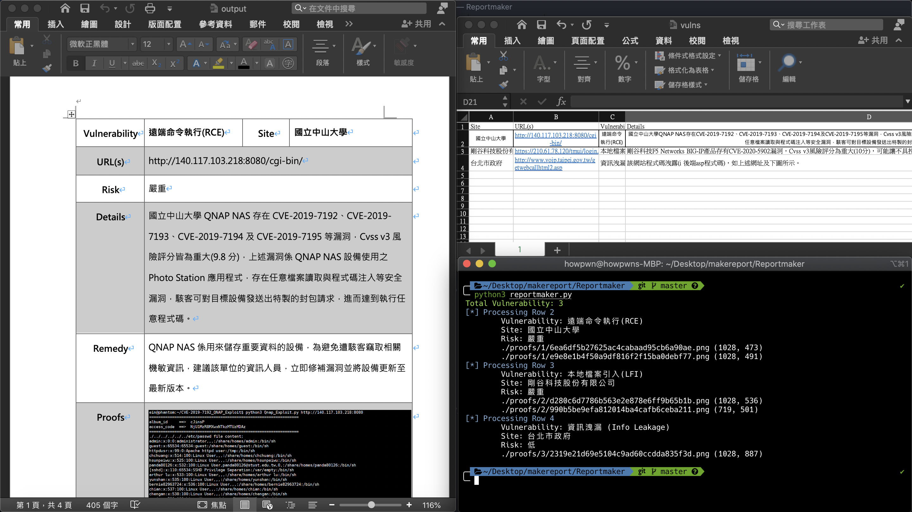

# Reportmaker

用來產滲透測試報告的工具

自動產報告 - 從 xlsx 裡抓資料匯出到 docx 裡

修改自原作者：[sda06407](https://github.com/sda06407)

測試資料使用 HITCON Zeroday 已公開且已修補已複測的漏洞。

https://zeroday.hitcon.org/vulnerability/ZD-2020-00485<br>
https://zeroday.hitcon.org/vulnerability/ZD-2020-00633<br>
https://zeroday.hitcon.org/vulnerability/ZD-2020-00764<br>

# Usage

```
pip3 install python-docx openpyxl
python3 reportmaker.py
```

# ScreenShot

產出報告: `output.docx`

